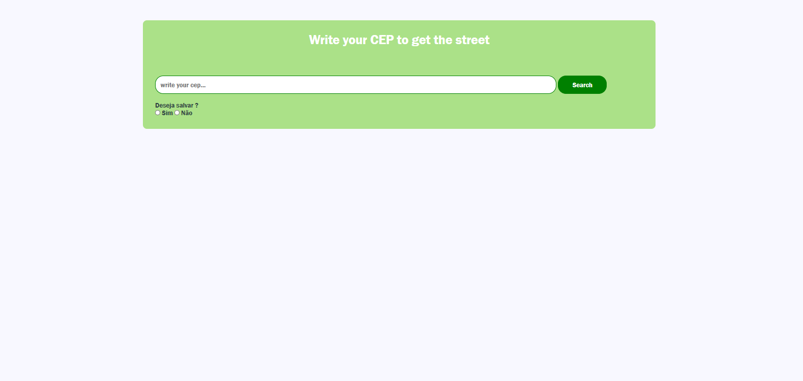
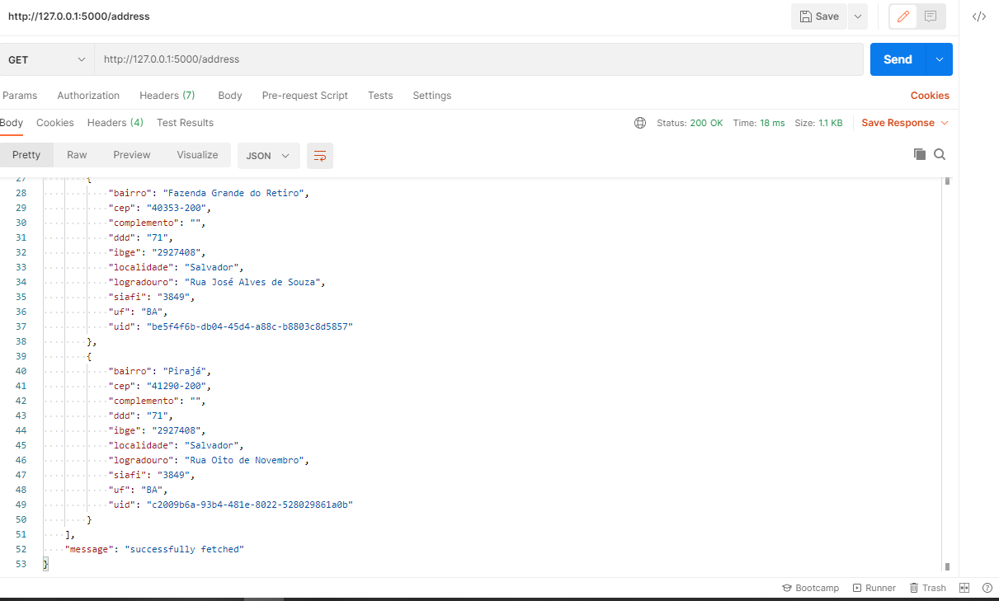
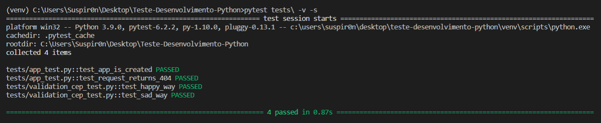

<p align="center">
  <a href="http://ant.design">
    
  </a>
</p>

<h1 align="center"> CEarch - an application of CEP search</h1>


# CEarch - Programming CEP search in python flask

## Description
This project illustrates an api in Flask and website for search the CEP.

## Starting

To run the project, you will need to install the following programs:

- [Python: Required to create the project](https://www.python.org/downloads/)
- [Mysql: Required a database to create the tables etc](https://www.mysql.com/)
- [VS Code: For project development](https://code.visualstudio.com/)

## ⌨️ Development

Use Gitpod, a free online dev environment for GitHub.

[](https://github.com/Suspir0n/Programming-CEP-Search.git)

Or use code locally using:
```
$ cd "directory of your choice"
$ git clone https://github.com/Suspir0n/Programming-CEP-Search.git
```

### Construction

To build the api with Flask, execute the commands below:

```
$ pip3 install -r requirements.txt
```

These are the requirements.txt dependencies:

```
flask==1.1.2
requests==2.25.1
pytest==6.1.2
flask-sqlalchemy==2.4.4
pymysql==1.0.2
flask-marshmallow==0.14.0
marshmallow-sqlalchemy==0.24.2
```

Make these settings so that your Flask application works perfectly

In Windows
```
$ set FLASK_APP=yourfile.py
$ set FLASK_ENV=Development
$ set FLASK_DEBUG=True
```

In Mac
```
$ export FLASK_APP=yourfile.py
$ export FLASK_ENV=Development
$ export FLASK_DEBUG=True
```

#### Database configuration 

I will show you how to connect to the mySQL database 
and its configuration. Remember, it does not create the 
database alone or the table so you have to create the 
database and tables first.

```
def connect_db(app):
    app.config['SQLALCHEMY_DATABASE_URI'] = 'mysql+pymysql://root:@localhost:3306/yourdatabase'
    app.config['SQLALCHEMY_TRACK_MODIFICATIONS'] = False
    
def config_db(app):
    db.init_app(app)
    app.app_context().push()
    db.create_all(app=app)
    app.db = db
```

After you set up the database, run your flask application
```
$ flask run
```

The exit:

```
* Serving Flask app "yourfile.py"
 * Environment: production
   WARNING: This is a development server. Do not use it in a production deployment.
   Use a production WSGI server instead.
 * Debug mode: off
 * Running on http://127.0.0.1:5000/ (Press CTRL+C to quit)
```

If you want to choose the host where it runs run this command

```
$ flask host 0.0.0.0
```

After running the application, a link will appear where it is 
being executed, accessing it you should see this page, use Postman
to have a better visibility



We will have to pass a json, in the case to register / post so 
that we can registrer address

```
{
  "cep": "69900-004",
  "logradouro": "Rua Barbosa Lima",
  "complemento": "",
  "bairro": "Base",
  "localidade": "Rio Branco",
  "uf": "AC",
  "ibge": "1200401",
  "gia": "",
  "ddd": "68",
  "siafi": "0139"
}
```

## Unit Test
The unit tests of routes were created using pytest, just run the command:

```
$ pytest tests\ -v -s
```


## Project Structure

```
|-- app
   |-- models
      |-- __init__.py
      |-- address_model.py
   |-- schemas
      |-- __init__.py
      |-- address_schemas.py
   |-- settings
      |-- __init__.py
      |-- config.py
      |-- connection.py
   |-- static
      |-- _CSS
         |-- style.css
   |--templates
      |-- index.html
      |-- response.html
   |-- views
      |-- __init__.py
      |-- address_views.py
   |-- __init__.py
|-- prototitypes
   |-- prototitype-001.png
   |-- prototitype-002.png
   |-- prototitype-003.png
|-- tests
   |-- __init__.py
   |-- app_test.py
   |-- conftest.py
   |-- validation_cep_test.py
|-- venv
|-- .gitignore
|-- __init__.py
|-- README.md    
|-- requirements.txt
```
app >> folder contains all API data, views, models, schemas, 
settings, all necessary data.
<br><br>
test folder >> contains route tests and field validation on the 
sad and happy path.
<br><br>
venv >> folder contains all the data of the premises that you 
will use.
<br><br>

## Features

The project can be used as a model to start the development of a Python project using Flask. It also demonstrates in a practical way how to create a Flask api quickly and easily.

## Configuration

To execute the project, it is necessary to use VsCode or an IDE of your preference, so that it identifies the dependencies necessary for execution in the repository. Once the project is imported, it will be possible to test its functionality in real time.

## Contributions

Contributions are always welcome! I hope I have helped someone in need.

## 🔓 License
MIT © [Evandro Silva](https://www.linkedin.com/in/suspir0n/)